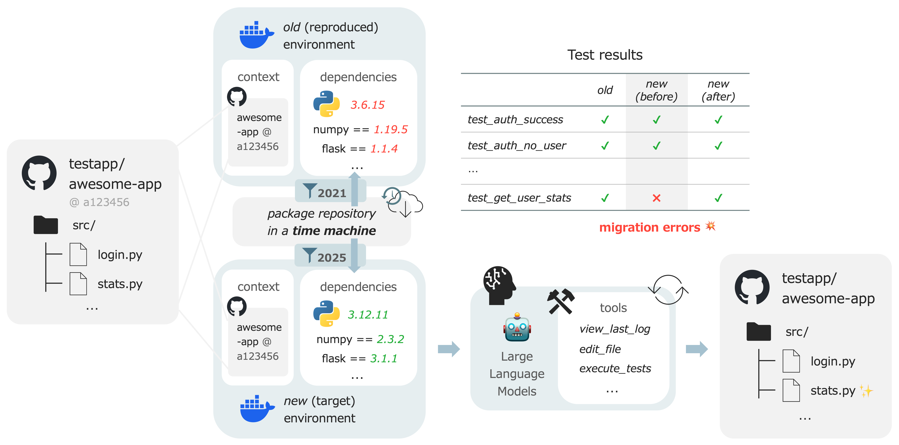

# TimeMachine-bench: A Benchmark for Evaluating Model Capabilities in Repository-Level Migration Tasks (EACL 2026)

[-blue)](https://2026.eacl.org/)
[](https://arxiv.org/abs/2601.22597)
[](https://opensource.org/licenses/Apache-2.0)

<div align="center">
  <a href="./assets/timemachine-bench_overview.png">
    
  </a>
</div>

<br>

**TimeMachine-bench** is a benchmark designed to evaluate model capabilities in repository-level migration tasks.
The benchmark consists of real-world GitHub repositories whose tests begin to fail in response to dependency updates.

The name *TimeMachine-bench* is derived from the idea of *time travel* for dependency solvers, where the solvers are provided with a date-filtered index to resolve dependencies as if they were operating in the past.
Our framework enables strict reproduction of environments at any specific point in time across the entire ecosystem, allowing for scalable evaluation without the need for predefined sets of target libraries.

## Repository Structure

| Directory | Description |
|:---|:---|
| [`services/`](./services) | Backend service for date-filtered PyPI servers (`pypi-timemachine`). |
| [`benchmark/`](./benchmark) | Scripts for the automated data construction pipeline. |
| [`agents/`](./agents) | Implementation of baseline agents and evaluation metrics. |

### Dataset

The datasets are provided in the `benchmark/data/v1` directory in JSONL format.

| File | # Repos | Description |
|:---|:---|:---|
| timemachine-bench-full.jsonl | 1,145 | The full dataset generated by our automated pipeline. |
| timemachine-bench-verified.jsonl | 100 | The human-verified subset with guaranteed solvability and difficulty labels. |
| timemachine-bench-random.jsonl | 100 | Randomly sampled subset of the full dataset. |

## Getting Started

### Prerequisites

- [uv](https://docs.astral.sh/uv/): For managing dependencies for the pipeline scripts.
- [docker](https://www.docker.com/): To provide isolated environments for secure execution of test suites.
- [jq](https://jqlang.org/): For parsing and processing JSON data within shell scripts.

### Quick Start

#### 1. Clone the repository

Use the `--recursive` flag to clone the main repository along with the `pypi-timemachine` submodule.

```bash
git clone --recursive https://github.com/tohoku-nlp/timemachine-bench.git
cd timemachine-bench
```

#### 2. Start the `pypi-timemachine` server

```bash
docker compose up -d
```

#### 3. Now, let's run the experiments!

- **Dataset construction**: See [`benchmark/README.md`](./benchmark/README.md) for instructions on the automated construction pipeline
- **Running baseline agents**: See [`agents/README.md`](./agents/README.md) for instructions on running baseline agents on the dataset.

### Citation

If you find TimeMachine-bench useful in your research, please consider citing the following paper:

```
@inproceedings{fujii-etal-2026-timemachine-bench,
    title = {{TimeMachine-bench: A Benchmark for Evaluating Model Capabilities in Repository-Level Migration Tasks}},
    author = {Fujii, Ryo and Morishita, Makoto and Yano, Kazuki and Suzuki, Jun},
    year = {2026},
    booktitle = {Proceedings of the 19th Conference of the European Chapter of the Association for Computational Linguistics (Volume 1: Long Papers)},
    note = {to appear}
}
```
